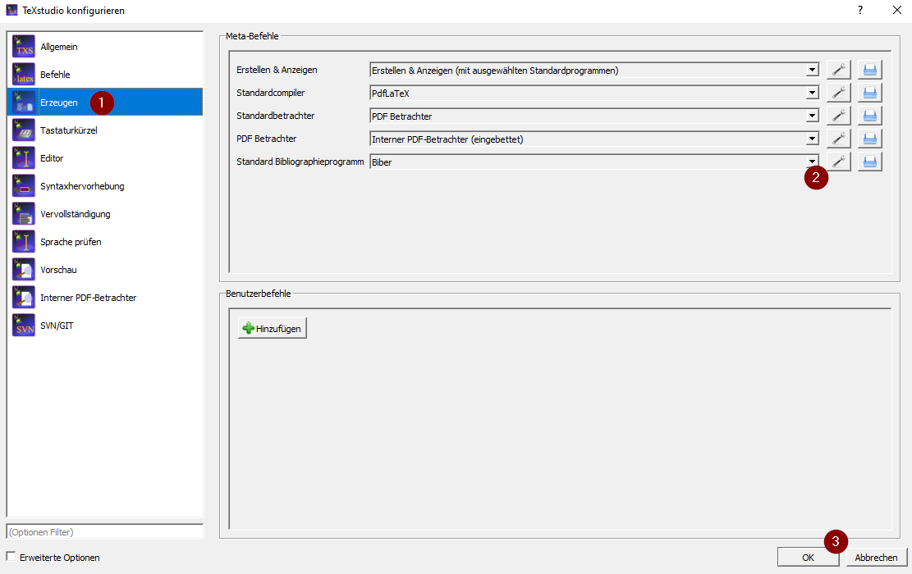
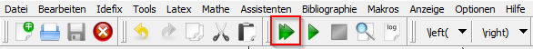
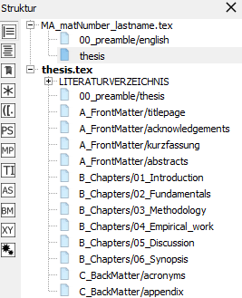
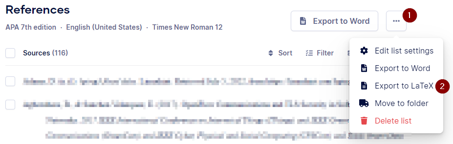
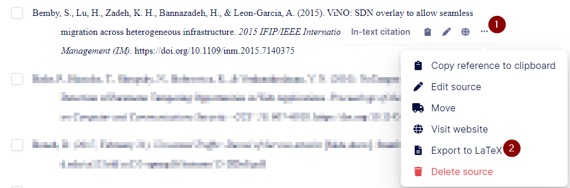
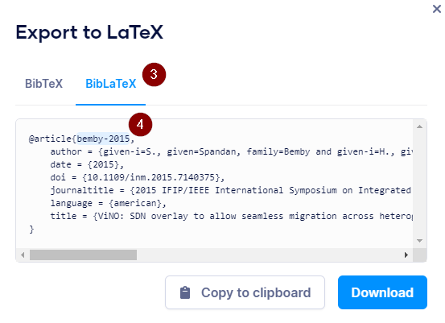

# Explanation - Master Thesis Latex Template

## Software and Tools

-   Recommended Latex editor: TeXstudio (https://www.texstudio.org/)

-   Recommended reference management tool:
    <https://www.scribbr.de/zitieren/generator/>

## Settings for TeXstudio

Since the Latex Template is using Biber as bibliography program, it is
necessary to change the setting within TeXstudio in order to display
references probably.

1.  Open TeXstudio, click on Options TeXstudio configuration

2.  Afterwards the following window should be visible. Configure Biber
    as default bibliography program as shown in the screenshot below:\
    

## Starting to adapt the Latex Template 

### Modify Global Settings and Title Page 

1.  Open MA_matNumber_lastname.tex file from the Latex Template

2.  Fill in the first part of the file according to your Master Thesis

3.  Choose your desired language

4.  Click on the double arrow to compile the file and show the output:\
    

5.  Afterwards you should see on the right side the Latex document with
    your adapted title page

6.  In that document you will find useful hints as well

### Setup your Latex Structure 

By default, the Latex Template structure is the following:\


You can modify this structure by importing additional files or removing
unnecessary once. It is recommended to write each chapter in a separate
file, as shown in the template structure. In order to modify the
structure, execute the following steps:

1.  In the structure column on the left-hand side of TeXstudio expand
    MA_matNumber_lastname.tex

2.  Click on thesis. Afterwards you should see the structure from the
    picture above

3.  In the thesis.tex file there is a section where certain files are
    imported:

```tex
\input{B_Chapters/01_Introduction}
\input{B_Chapters/02_Fundamentals}
\input{B_Chapters/03_Methodology}
\input{B_Chapters/04_Empirical_work}
\input{B_Chapters/05_Discussion}
\input{B_Chapters/06_Synopsis}
```

4.  There you can add, remove or reorder certain chapters. Follow the
    same pattern in order to create a new chapter files. When you create
    a new chapter file, it will be highlighted in red on the left-hand
    side in the structure column. Click on the highlighted chapter,
    TeXstudio will ask you to create this file since it is not there
    yet. Confirm this request. Afterwards you can see this chapter file
    in your Latex Template folder within the B_Chapters folder.

## References and Citing 

### Import References from Scribber to TeXstudio

Using the Scribber reference generator
(<https://www.scribbr.de/zitieren/generator/>) enables to generate the
references automatically based on DIO/ISBN number or URL. It also offers
reference management functionalities and is that's why recommended.

Execute the following steps in order to export the references from
Scribber to TeXstudio:

1.  Export your references to Latex\
    

2.  Choose BibLaTex and copy all entries to clipboard

3.  Open the references.bib file in the Latex Template folder and paste
    the previous copied references there. Make sure none of your entries
    included special characters like &. If so, you need to add a
    backslash (\\) in front of those characters in order to avoid some
    errors during compiling the file. Make sure you save the file before
    you close it.

### Citing in Latex

As per requirement of the FH Burgenland, the APA style should be used
for quotation. There are two different options to display the references
using the APA style. On the one hand, mentioning the reference within
the sentence, for example: *In research from Bemby et al. (2015)....* On
the other hand, mentioning the reference at the end of a paragraph or
sentence, like: *According to new research ... (Bemby et al., 2015)*.
Both options require a different keyword within Latex to display the
references properly.

#### Option 1: Reference within Sentence

In order to cite your reference within the sentence you need to use the
following keyword:

```tex
\citet{<cite_key>}
```

The cite_key is a unique label for each reference and is automatically
created by Scribber. You can find it in your Scribber reference list:\
\


#### Option 2: Reference at the end of a paragraph/sentence

In order to indicate that the last paragraph/sentence is based on one or
more references, you need to indicate them at the end of the paragraph
or sentence with the following keyword:

```tex
\citep{<cite_key1>,<cite_key2>}
```

## Acronyms 

The acronym list is part of the Latex template showing the syntax for
creating additional acronyms. Unfortunately, there is no build in
functionality to sort the acronym list alphabetical. It is necessary to
use external programs for that purpose like Excel or Notepad++.
Currently the Latex template is not able to reference acronyms within
the text because of an unknown error. You are welcome to solve the issue
and improve the Latex template.

## Author information

Original Author: Dominik Thiede (https://www.linkedin.com/in/dominik-thiede/)